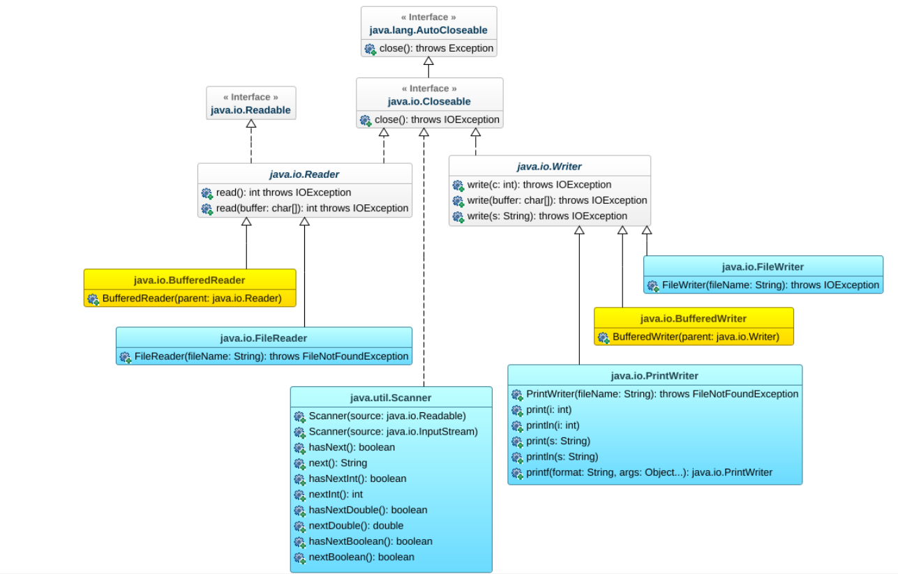
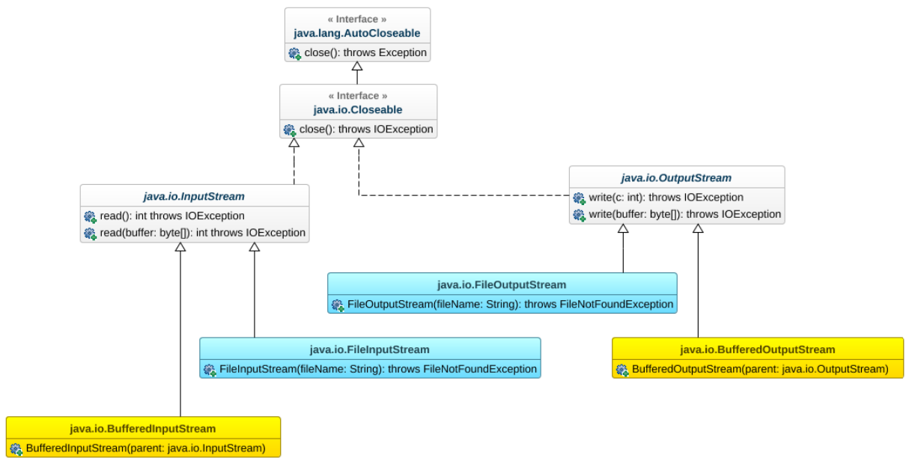

# Lezione di Informatica - Programmazione Java (Parte 3)

## 1. Reader e Writer

Le classi astratte:
- `java.io.Reader` → lettura di caratteri
- `java.io.Writer` → scrittura di caratteri

Permettono di gestire file testuali.

---

## 2. Lettura di File di Caratteri

### FileReader

```java
FileReader reader = new FileReader("file.txt");
int c = reader.read();
```

### Metodi principali Reader
- `int read()` → legge un carattere
- `int read(char[] buffer)` → legge più caratteri

---

## 3. BufferedReader

Aggiunge buffering (più efficiente):

```java
BufferedReader br = new BufferedReader(new FileReader("file.txt"));
String linea = br.readLine();
```

---

## 4. Scrittura di File di Caratteri

### FileWriter

```java
FileWriter writer = new FileWriter("file.txt");
writer.write("Ciao");
```

### Metodi principali Writer
- `write(int c)`
- `write(char[] buffer)`
- `write(String s)`

---

## 5. BufferedWriter

```java
BufferedWriter bw = new BufferedWriter(new FileWriter("file.txt"));
bw.write("Testo");
bw.close();
```

---

## 6. PrintWriter

Permette una scrittura più semplice:

```java
PrintWriter pw = new PrintWriter("file.txt");
pw.println("Hello");
pw.printf("Numero: %d", 10);
```

### Metodi utili
- `print()`
- `println()`
- `printf()`

---

## 7. File di Byte (Raw)

### Lettura

- `InputStream`
- `FileInputStream`
- `BufferedInputStream`

```java
InputStream in = new FileInputStream("file.bin");
int b = in.read();
```

### Scrittura

- `OutputStream`
- `FileOutputStream`
- `BufferedOutputStream`

```java
OutputStream out = new FileOutputStream("file.bin");
out.write(65);
```

---

## 8. Esempio: dumpAsText

```java
public void dumpAsText(String fileName) throws IOException {
    PrintWriter pw = new PrintWriter(fileName);
    pw.println(this.toString());
    pw.close();
}
```

---

## 9. Costruttore con Scanner

```java
public Date(Scanner sc) {
    int giorno = sc.nextInt();
    int mese = sc.nextInt();
}
```

Serve per leggere oggetti da file.

---

## 10. Buone pratiche

- Usare `try-with-resources`
- Usare buffer per efficienza
- Chiudere sempre i file

---

## Conclusione

Le classi di I/O permettono di:
- leggere e scrivere file testuali
- gestire dati binari
- migliorare efficienza con buffering
- semplificare codice con PrintWriter


