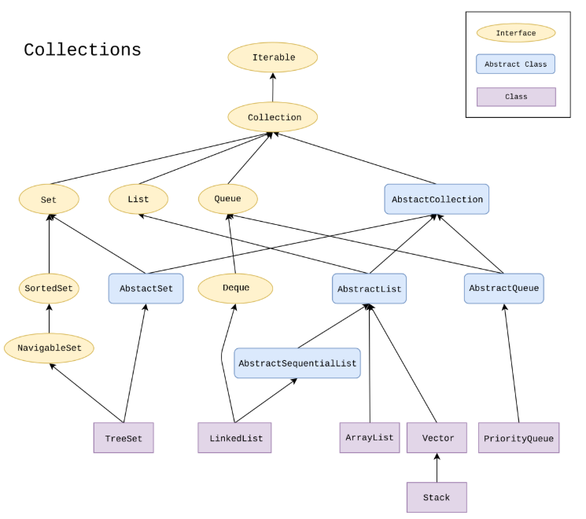

# Java Collections Framework e Iterable

## 1. Interfaccia `Iterable<E>`

L'interfaccia `Iterable<E>` rappresenta un oggetto i cui elementi possono essere iterati uno alla volta.

È alla base del ciclo **for-each**:

```java
for (E elemento : collezione) {
    // usa elemento
}
```

Per poter usare il for-each, una classe deve implementare `Iterable<E>` e fornire un iteratore.

---

## 2. Collections Framework

Il **Collections Framework** è un insieme di interfacce e classi per gestire gruppi di oggetti.

### Principali interfacce:

* `Collection<E>` → interfaccia base
* `List<E>` → lista ordinata con duplicati
* `Set<E>` → insieme senza duplicati
* `Queue<E>` → coda (FIFO o con priorità)

---

## 3. Interfaccia `Collection<E>`

Metodi principali:

* `boolean add(E element)` → aggiunge un elemento
* `boolean addAll(Collection<E> other)` → aggiunge tutti gli elementi
* `boolean contains(Object element)` → verifica presenza
* `boolean containsAll(Collection<?> other)` → verifica contenimento
* `boolean isEmpty()` → controlla se vuota
* `boolean remove(Object element)` → rimuove elemento
* `boolean removeAll(Collection<?> other)` → rimuove più elementi
* `boolean retainAll(Collection<?> other)` → mantiene solo elementi comuni
* `int size()` → numero di elementi

---

## 4. Interfaccia `List<E>`

Collezione ordinata e indicizzata.

Metodi principali:

* `boolean add(E element)`
* `void add(int index, E element)`
* `E get(int index)`
* `int indexOf(Object element)`
* `boolean remove(Object element)`
* `E remove(int index)`
* `E set(int index, E element)`

### Factory method

```java
List<Integer> lista = List.of(1, 2, 3);
```

⚠️ Lista **immutabile**.

---

## 5. Interfaccia `Queue<E>`

Rappresenta una coda (tipicamente FIFO).

Metodi principali:

* `E poll()` → rimuove testa (null se vuota)
* `E remove()` → rimuove testa (eccezione se vuota)
* `E peek()` → legge testa (null se vuota)
* `E element()` → legge testa (eccezione se vuota)
* `boolean offer(E element)` → inserisce elemento
* `boolean add(E element)` → inserisce (eccezione se fallisce)

---

## 6. Interfaccia `Set<E>`

Collezione senza duplicati.

### Factory method

```java
Set<String> set = Set.of("a", "b", "c");
```

⚠️ Set **immutabile**.

---

## 7. Classi principali

### `ArrayList<E>`

* Lista basata su array dinamico
* Accesso veloce per indice

Costruttori:

```java
new ArrayList<>()
new ArrayList<>(collection)
```

---

### `LinkedList<E>`

* Lista collegata
* Può essere usata anche come coda (implementa `Queue`)

Costruttori:

```java
new LinkedList<>()
new LinkedList<>(collection)
```

---

### `PriorityQueue<E>`

* Coda con priorità
* Gli elementi vengono ordinati automaticamente
* Non ha limite massimo (unbounded)

Costruttori:

```java
new PriorityQueue<>()
new PriorityQueue<>(collection)
```

---

### `Vector<E>` (deprecata)

* Simile ad `ArrayList`
* Sincronizzata (più lenta)
* **Non consigliata**

---

## 8. Differenze principali

| Struttura | Ordinamento | Duplicati | Accesso per indice |
| --------- | ----------- | --------- | ------------------ |
| List      | Sì          | Sì        | Sì                 |
| Set       | No          | No        | No                 |
| Queue     | FIFO/altro  | Sì        | No                 |

---

## 9. Esempio completo

```java
import java.util.*;

public class Esempio {
    public static void main(String[] args) {
        List<Integer> lista = new ArrayList<>();
        lista.add(1);
        lista.add(2);
        lista.add(3);

        for (int x : lista) {
            System.out.println(x);
        }

        Queue<Integer> coda = new LinkedList<>();
        coda.offer(10);
        coda.offer(20);

        System.out.println(coda.poll());

        Set<Integer> insieme = Set.of(1, 2, 3);
        System.out.println(insieme.contains(2));
    }
}
```

---

## 10. Riassunto

* `Iterable` permette il for-each
* `Collection` è la base del framework
* `List` → ordinata e indicizzata
* `Set` → no duplicati
* `Queue` → gestione FIFO/priorità
* `ArrayList`, `LinkedList`, `PriorityQueue` → implementazioni principali
* `Vector` → obsoleta

