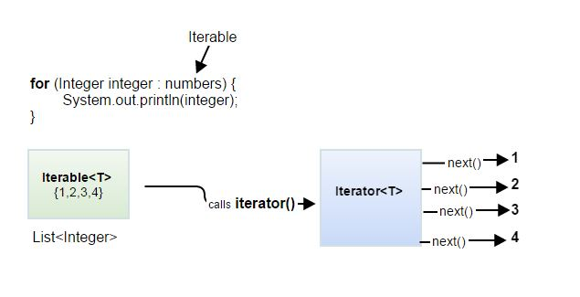

# Iterable<T> e Iterator<T>

---

## 1. Introduzione

Nel linguaggio Java, le interfacce `Iterable<T>` e `Iterator<T>` costituiscono il fondamento del meccanismo di iterazione sugli oggetti, permettendo di attraversare collezioni e strutture dati in modo uniforme.

Queste interfacce sono alla base del costrutto **for-each** (enhanced for loop).

---

## 2. Interfaccia Iterable<T>

L'interfaccia `Iterable<T>` rappresenta una collezione di elementi che può essere attraversata sequenzialmente.

### Metodo principale

```java
Iterator<T> iterator()
```

* Restituisce un oggetto `Iterator<T>`
* Permette di accedere agli elementi uno alla volta

### Esempio di utilizzo

```java
for (T elemento : collezione) {
    System.out.println(elemento);
}
```

Questo costrutto viene tradotto internamente in un uso esplicito di `Iterator`.

---

## 3. Interfaccia Iterator<T>

L'interfaccia `Iterator<T>` consente di scorrere una sequenza di elementi.

### Metodi principali

```java
boolean hasNext()
T next()
```

* `hasNext()` → verifica se ci sono ancora elementi
* `next()` → restituisce l'elemento successivo

### Esempio

```java
Iterator<Integer> it = lista.iterator();

while (it.hasNext()) {
    Integer valore = it.next();
    System.out.println(valore);
}
```

---

## 4. Rendere una classe iterabile

Per rendere una classe iterabile è necessario:

1. Implementare `Iterable<T>`
2. Definire il metodo `iterator()`

---

## 5. Implementazione per delega

Una tecnica comune è la **delega**: si sfrutta un oggetto interno già iterabile.

### Esempio (Desk del laboratorio)

```java
import java.util.*;

public class Desk implements Iterable<String> {

    private List<String> studenti = new ArrayList<>();

    public void aggiungiStudente(String nome) {
        studenti.add(nome);
    }

    @Override
    public Iterator<String> iterator() {
        return studenti.iterator(); // delega
    }
}
```

### Uso

```java
Desk desk = new Desk();
desk.aggiungiStudente("Alice");
desk.aggiungiStudente("Bob");

for (String s : desk) {
    System.out.println(s);
}
```

---

## 6. Classi interne

Le **classi interne** (inner classes) sono classi definite all'interno di un'altra classe.

### Tipologie

* Classe interna non statica
* Classe interna statica

---

## 7. Classe interna non statica

* Ha accesso ai membri dell'oggetto esterno
* È legata a un'istanza della classe esterna

### Esempio con Iterator personalizzato

```java
import java.util.Iterator;
import java.util.NoSuchElementException;

public class Contenitore implements Iterable<Integer> {

    private int[] dati = {1, 2, 3, 4};

    @Override
    public Iterator<Integer> iterator() {
        return new MioIterator();
    }

    private class MioIterator implements Iterator<Integer> {

        private int indice = 0;

        @Override
        public boolean hasNext() {
            return indice < dati.length;
        }

        @Override
        public Integer next() {
            if (!hasNext()) {
                throw new NoSuchElementException();
            }
            return dati[indice++];
        }
    }
}
```

---

## 8. Classe interna statica

* Non ha accesso diretto ai membri non statici della classe esterna
* È indipendente dall'istanza

### Quando usarla

* Quando l'iteratore non necessita dello stato dell'oggetto esterno

---

## 9. Confronto tra approcci

| Approccio      | Vantaggi               | Svantaggi       |
| -------------- | ---------------------- | --------------- |
| Delega         | Semplice, riuso codice | Meno flessibile |
| Classe interna | Massimo controllo      | Più codice      |

---

## 10. Best Practices

* Usare delega quando possibile
* Usare classi interne per comportamenti personalizzati
* Non esporre direttamente strutture interne modificabili

---

## 11. Conclusione

Le interfacce `Iterable<T>` e `Iterator<T>` permettono di standardizzare l'accesso sequenziale ai dati.

Comprendere e implementare correttamente questi strumenti è fondamentale per progettare API Java pulite, riutilizzabili e compatibili con il linguaggio.

---

## 12. Esercizi suggeriti

1. Implementare una classe `Libro` iterabile sulle sue pagine
2. Creare un iteratore che restituisce solo numeri pari
3. Implementare un iteratore inverso

---

